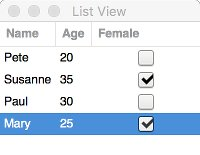

# List and Tree Widgets

The `GtkTreeView` is a very powerful widgets for displaying table-like or hierachical data.
Other than the name might indicate the `GtkTreeView` is used for both lists and trees.

The power of this widget comes with a slightly more complex design that one has to understand when 
using the widget. The most important thing is that the widget itself does not store the displayed
data. Instead there are dedicated `GtkListStore` and `GtkTreeStore` containers that will hold the data.
The benefit of this approach is that it is possible to decouple the view from the data:

  * The widget automatically updates when adding, removing or editing data from the store
  * The widget can sort its data without modifications in the store
  * Columns can be reordered and resized
  * Filtering can be used to show only subsets of data

We will in the following introduce both widgets based on small and a more complex example.

## List Store

Lets start with a very simple example: A table with three columns representing
the name, the age and the gender of a person. Each column must have a specific type. 
Here, we chose to represent the gender using a boolean value where `true`  represents
female and `false` represents male. We thus initialize the list store using
```julia
ls = @ListStore(String, Int, Bool)
```
Now we will the store with data
```julia
push!(ls,("Peter",20,false))
push!(ls,("Paul",30,false))
push!(ls,("Mary",25,true))
```
If we want so insert the data at a specific position we can use the insert function
```julia
insert!(ls, 2, ("Susanne", 35, true))
```
You can use `ls` like a matrix like container. Calling `length` and `size` will give you
```julia
julia> length(ls)
4

julia> size(ls)
(4,3)
```
Specific element can be be accessed using
```julia
julia> ls[1,1]
"Peter"
julia> ls[1,1] = "Pete"
"Pete"
```

## List View

Now we actually want to display our data. To this end we create a tree view object
```julia
tv = @TreeView(TreeModel(ls))
```
Then we need specific renderers for each of the columns. Usually you will only
need a text renderer, but in our example we want to display the boolean value
using a checkbox.
```julia
rTxt = @CellRendererText()
rTog = @CellRendererToggle()
```
Finally we create for each column a `TreeViewColumn` object
```julia
c1 = @TreeViewColumn("Name", rTxt, Dict([("text",0)]))
c2 = @TreeViewColumn("Age", rTxt, Dict([("text",1)]))
c3 = @TreeViewColumn("Female", rTog, Dict([("active",2)]))
```
We need to push these column description objects to the tree view
```julia
push!(tv, c1, c2, c3)
```
Then we can display the tree view widget in a window
```julia
win = @Window(tv, "List View")
showall(win)
```



TODO

## selection
selmodel = G_.selection(tv)
@test hasselection(selmodel) == false
select!(selmodel, Gtk.iter_from_index(ls, 1))
@test hasselection(selmodel) == true
iter = selected(selmodel)
@test ls[iter, 1] == 44
deleteat!(ls, iter)
@test isvalid(ls, iter) == false

tmSorted=@TreeModelSort(ls)
G_.model(tv,tmSorted)
G_.sort_column_id(TreeSortable(tmSorted),0,GtkSortType.ASCENDING)
it = convert_child_iter_to_iter(tmSorted,Gtk.iter_from_index(ls, 1))
select!(selmodel, it)
iter = selected(selmodel)
@test TreeModel(tmSorted)[iter, 1] == 35

destroy(w)


## Tree Widget

TODO

